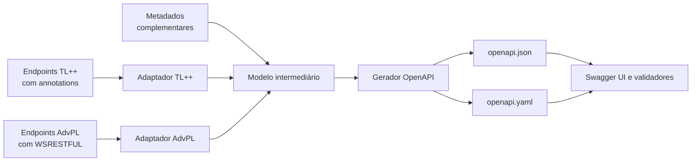

# Protheus OpenAPI

> Gerador experimental de documentação OpenAPI para APIs REST desenvolvidas no TOTVS Protheus.

## Sobre o projeto

O **Protheus OpenAPI** nasce com a proposta de estudar e desenvolver uma biblioteca, escrita prioritariamente em **TL++ (TLPP)**, capaz de produzir especificações no padrão OpenAPI para APIs REST do Protheus.

Além do objetivo técnico, este repositório é uma jornada pública de aprendizado. A evolução do projeto será utilizada para explorar recursos da linguagem TL++, registrar decisões de arquitetura e compartilhar os resultados em artigos no blog do autor.

O projeto pretende atender dois modelos de implementação REST:

- endpoints modernos em TL++ baseados em annotations, como `@Get`, `@Post`, `@Put`, `@Patch` e `@Delete`;
- endpoints legados ou customizados em AdvPL baseados em `WSRESTFUL`, `WSMETHOD`, `WSSYNTAX` e estruturas relacionadas.

## Motivação

Documentar manualmente uma API costuma gerar divergências entre o código publicado e sua especificação. No Protheus, o desafio aumenta porque diferentes gerações do framework REST podem coexistir no mesmo ambiente.

O `tlppCore` já oferece um mecanismo nativo de documentação com saída Swagger. Portanto, este projeto **não parte da premissa de substituir esse recurso**. A investigação busca compreender seus limites e avaliar oportunidades como:

- oferecer uma representação OpenAPI uniforme para APIs TL++ e AdvPL;
- enriquecer operações com schemas, exemplos, respostas e mecanismos de segurança;
- validar inconsistências entre rotas e metadados;
- permitir geração em processos de desenvolvimento, integração contínua ou execução no AppServer;
- apoiar ambientes e customizações que ainda utilizam `WSRESTFUL`.

## Objetivos

- Aprender TL++ por meio da construção de uma ferramenta real.
- Gerar uma especificação OpenAPI 3.0.3 válida em JSON e, futuramente, YAML.
- Separar a descoberta dos endpoints da geração do documento OpenAPI.
- Suportar progressivamente APIs REST escritas em TL++ e AdvPL.
- Permitir complementação declarativa quando o código não contiver informações suficientes.
- Manter exemplos, testes e decisões técnicas documentados durante toda a evolução.

## Não são objetivos iniciais

- Substituir oficialmente ferramentas ou componentes fornecidos pela TOTVS.
- Inferir com precisão absoluta qualquer payload JSON criado dinamicamente.
- Extrair o código-fonte original de um RPO compilado.
- Alterar ou publicar automaticamente fontes no RPO.
- Implementar toda a especificação OpenAPI na primeira versão.

## Visão da solução

A arquitetura será organizada em três responsabilidades principais:

1. **Descoberta:** localizar endpoints, verbos, caminhos e parâmetros.
2. **Modelo intermediário:** representar a API sem acoplamento direto ao AdvPL, TL++ ou formato final.
3. **Geração:** serializar o modelo como uma especificação OpenAPI válida.

Como os corpos de requisição e resposta podem ser construídos dinamicamente, a solução deverá combinar inferência segura com metadados explícitos. A forma definitiva desses metadados será decidida após os primeiros experimentos com annotations, reflection e análise de fontes.

## Status do projeto

O núcleo manual mínimo está concluído e validado como um recorte experimental da biblioteca. Ele já permite montar, validar e serializar em JSON um documento OpenAPI 3.0.3; a descoberta automática de endpoints ainda não faz parte desta entrega.

| Marco | Estado |
| --- | --- |
| Definição da visão e do roadmap | Concluído para o núcleo mínimo |
| Provas de conceito em TL++ | Concluído |
| Núcleo do modelo OpenAPI | Concluído |
| Parâmetros, schemas e request body | Implementado e validado (compilação, PROBAT e HTTP reais) |
| Adaptador para descoberta de endpoints TL++ | Implementado e validado (compilação e PROBAT reais) |
| Suporte a `WSRESTFUL` em AdvPL | Planejado |
| Primeira versão experimental | Planejado |

### Núcleo mínimo validado

O primeiro vertical slice reúne seis classes no namespace `custom.openapi.core`: `OApiInfo`, `OApiResp`, `OApiOper`, `OApiPath`, `OApiDoc` e `OApiJson`. O exemplo `GET /api/v1/openapi/core` monta manualmente a documentação do Hello World, valida o modelo antes da saída e retorna JSON OpenAPI 3.0.3.

A implementação possui testes TL++ executados pelo PROBAT, contratos estáticos em Python e uma fixture JSON validada estruturalmente. O [diário técnico do núcleo](docs/experiments/openapi-core-model.md) reúne arquitetura, evidências TDD, rastreabilidade e comandos reproduzíveis.

Este marco conclui a modelagem e a serialização manuais. O adaptador para descobrir annotations TL++ automaticamente já está implementado e validado (ver seção abaixo); o adaptador para serviços `WSRESTFUL` AdvPL continua planejado e será desenvolvido separadamente (Fase 4).

### Parâmetros e schemas — implementado e validado

O incremento seguinte estende o núcleo com três classes novas (`OApiSchema`, `OApiParam`, `OApiBody`) e amplia `OApiOper`, `OApiResp`, `OApiDoc` e `OApiJson` para representar parâmetros `path`/`query`/`header`, request bodies, respostas com schema e `components/schemas` com resolução transitiva de referências `$ref`. Os exemplos `GET /api/v1/hello/:name` e `POST /api/v1/hello` demonstram o incremento, e `GET /api/v1/openapi/core` passa a publicar as duas operações e os três schemas reutilizáveis (`HelloRequest`, `HelloResponse`, `ErrorResponse`).

Todo o código foi escrito seguindo TDD (RED/GREEN) e passa no contrato estático Python e nas fixtures OpenAPI do projeto. Os 11 fontes da feature foram compilados no `P12_2510`, o fixture `OApiTst` rodou via PROBAT sem erros, e os endpoints de demonstração foram verificados com chamadas HTTP reais (401 sem autenticação, 200/400 conforme o payload, documento OpenAPI enriquecido). O [diário técnico do incremento](docs/experiments/openapi-parameters-schemas.md) detalha a rastreabilidade completa e o bug de autodocumentação encontrado e corrigido durante essa verificação.

### Adaptador TL++ — implementado e validado

A Fase 3 do roadmap elimina a montagem manual: quatro classes novas em `src/adapters/` (namespace `custom.openapi.adapter.tlpp`) descobrem endpoints TL++ anotados por introspecção real, em vez de exigir que cada path/operação seja redigitado à mão. `OApiAdpDsc` enumera funções anotadas com um verbo (`@Get`, `@Post`, ...) via `Reflection.getFunctionsByAnnotation()`/`getFunctionAnnotation()` — uma API confirmada por spike empírico (compilação e HTTP reais), não documentada com precisão suficiente no TDN. `OApiAdpPath` converte o texto do `endpoint` anotado (`:nome` → `{nome}`) e extrai os parâmetros de path. `OApiAdpMeta` converte os atributos complementares `params`/`requestBody`/`responses` (JSON serializado, formato definido por este incremento) em `OApiParam`/`OApiBody`/`OApiResp`. `OApiAdpBuild` monta o `OApiDoc` completo a partir dos três anteriores, reaproveitando 100% da API pública do núcleo sem alterá-lo.

Como o `endpoint` anotado é a única fonte usada para gerar o path, a classe de bug encontrada na sessão anterior (path registrado sob uma chave diferente da rota real) fica estruturalmente impossível neste fluxo — não há mais um segundo lugar onde o path possa ser redigitado e divergir. O [diário técnico do incremento](docs/experiments/openapi-tlpp-adapter.md) documenta o spike de verificação da API de reflection (com evidência HTTP real), a rastreabilidade completa e as limitações de inferência conhecidas (reflection em métodos de classe, tipos de retorno, rotas dinâmicas).

## Roadmap de aprendizado e desenvolvimento

O roadmap é incremental: cada fase deve produzir um resultado demonstrável e material suficiente para registrar o aprendizado no blog.

### Fase 0 — Pesquisa e delimitação

**Resultado esperado:** matriz comparativa entre os recursos nativos e as lacunas que justificam o projeto.

- estudar o REST `tlppCore`, REST 2.0 e o gerador de documentação existente;
- criar endpoints mínimos equivalentes em TL++ e AdvPL;
- comparar as informações disponíveis em annotations e `WSRESTFUL`;
- definir a versão inicial do OpenAPI e os critérios de validação;
- registrar restrições de versão do AppServer, LIB e `tlppCore`.

**Aprendizado TL++:** ambiente, compilação, namespaces, includes, tipagem e estrutura básica da linguagem.

### Fase 1 — Fundamentos em TL++

**Resultado esperado:** uma prova de conceito capaz de construir e serializar um documento OpenAPI mínimo.

- praticar classes, métodos, encapsulamento e tratamento de exceções;
- explorar `JsonObject`, arrays tipados e serialização;
- estudar annotations e reflection;
- definir as primeiras entidades internas: documento, caminho, operação e parâmetro;
- criar testes para a serialização produzida.

**Aprendizado TL++:** orientação a objetos, JSON, annotations, reflection e testes automatizados.

### Fase 2 — Núcleo OpenAPI

**Resultado esperado:** geração de um `openapi.json` válido a partir do modelo intermediário.

- implementar `info`, `servers`, `paths`, `operations` e `components`;
- suportar parâmetros de path, query e header;
- representar respostas e schemas reutilizáveis;
- validar a saída contra a especificação OpenAPI 3.0.3;
- criar mensagens de erro claras para metadados inválidos.

**Aprendizado TL++:** design de APIs internas, composição de objetos, validação e tratamento de erros.

### Fase 3 — Adaptador para endpoints TL++

**Resultado esperado:** descobrir endpoints TL++ de exemplo e gerar automaticamente suas operações básicas.

- reconhecer annotations dos verbos HTTP;
- extrair endpoint, descrição e parâmetros disponíveis;
- avaliar reflection em funções e métodos de classes;
- definir annotations complementares para schemas, respostas e exemplos;
- documentar limitações de inferência.

**Aprendizado TL++:** criação e leitura de annotations, reflection e integração com o REST do `tlppCore`.

### Fase 4 — Adaptador para AdvPL

**Resultado esperado:** documentar uma API de exemplo baseada em `WSRESTFUL` usando o mesmo modelo intermediário.

- reconhecer `WSRESTFUL`, `WSMETHOD`, `WSSYNTAX`, `PATH` e `DESCRIPTION`;
- interpretar `WSDATA` e `WSRECEIVE` quando possível;
- definir comentários ou metadados estruturados para informações ausentes;
- tratar variações de sintaxe e construções multilinha;
- comparar o resultado com o adaptador TL++.

**Aprendizado TL++:** leitura de arquivos, tokenização, expressões regulares e interoperabilidade com código AdvPL.

### Fase 5 — Schemas e padrões TOTVS

**Resultado esperado:** especificações úteis para consumidores reais da API, não apenas uma lista de rotas.

- descrever request bodies e responses;
- adicionar exemplos, códigos HTTP e modelos de erro;
- representar Basic, Bearer e outros esquemas de segurança aplicáveis;
- avaliar cabeçalhos, paginação e extensões `x-totvs`;
- investigar geração opcional de schemas com apoio do dicionário de dados SX3.

**Aprendizado TL++:** metaprogramação, integração com o Protheus e modelagem de estruturas complexas.

### Fase 6 — Distribuição e experiência de uso

**Resultado esperado:** primeira versão experimental reproduzível por outros desenvolvedores.

- disponibilizar uma API simples para configurar e executar o gerador;
- avaliar execução por função, job, linha de comando ou endpoint REST;
- gerar JSON e YAML;
- publicar um exemplo com Swagger UI;
- preparar guia de instalação, compatibilidade e solução de problemas;
- automatizar testes e validações no pipeline do repositório.

**Aprendizado TL++:** empacotamento, execução no AppServer, observabilidade e compatibilidade entre ambientes.

## Definição do primeiro MVP

O primeiro MVP será considerado concluído quando:

- gerar um documento OpenAPI 3.0.3 válido em JSON;
- documentar ao menos um endpoint TL++ e um endpoint AdvPL de exemplo;
- identificar verbo, caminho, descrição e parâmetros básicos;
- aceitar metadados explícitos para um schema de requisição e um de resposta;
- possuir testes reproduzíveis para o documento gerado;
- apresentar limitações e requisitos de compatibilidade de forma clara.

## Estratégia de testes

A evolução deverá ser acompanhada por diferentes níveis de verificação:

- testes unitários do modelo e do serializador;
- arquivos de exemplo com casos válidos e inválidos;
- validação automática do documento contra o schema OpenAPI;
- testes de integração em um AppServer compatível;
- comparação do resultado com endpoints reais de demonstração;
- testes de regressão para construções AdvPL e TL++ já suportadas.

Os scripts de gate do repositório (`scripts/*.py`, `tests/**/validate-sources.py`, `tests/openapi-normalization/run-tests.py`) são escritos em **Python** (originalmente eram PowerShell, migrados nesta sessão). A motivação é controlar o encoding de forma explícita: o fluxo de trabalho AdvPL/TL++ deste projeto é fortemente CP-1252, e o PowerShell 5.1 já causou bugs reais aqui — um `.ps1` sem BOM UTF-8 lendo acentos incorretamente do próprio script — justamente a classe de erro que `open(arquivo, encoding=...)` evita por ser explícito em vez de depender de heurísticas de codepage do sistema.

## Acompanhando a evolução

Cada fase deverá gerar:

- código e exemplos no repositório;
- atualização do status neste README;
- registro das decisões e limitações encontradas;
- um possível artigo apresentando o problema, os experimentos e o resultado obtido.

O conteúdo publicado terá caráter educacional. Recursos experimentais serão identificados como tal, e nenhuma API do framework TOTVS será presumida sem validação em documentação ou ambiente compatível.

## Como contribuir

O projeto ainda está definindo suas bases. Sugestões de casos de uso, exemplos de APIs REST Protheus e relatos sobre limitações da documentação atual serão bem-vindos por meio das issues do repositório.

Contribuições de código deverão, futuramente, seguir as convenções de desenvolvimento, testes e compatibilidade documentadas pelo projeto.

## Referências

- [TLPP — TOTVS TDN](https://tdn.totvs.com/display/tec/TLPP)
- [REST server (tlppCore) — TOTVS TDN](https://tdn.totvs.com/display/tec/Rest)
- [Evolução do REST e REST 2.0 — TOTVS TDN](https://tdn.totvs.com/display/framework/Entendendo%2Bas%2Bnovidades%2Bdo%2BREST)
- [Definição de APIs no padrão OpenAPI 3.0 — TOTVS TDN](https://tdn.totvs.com/display/framework/Processo%2Bde%2BScripts%2Bcom%2Bfoco%2Bem%2BDesenvolvimento3.%2BDefinindo%2Buma%2BAPI)
- [OpenAPI Specification 3.0.3](https://spec.openapis.org/oas/v3.0.3)

## Licença

Este projeto é distribuído sob a [licença MIT](LICENSE).

## Aviso legal

Este é um projeto independente, experimental e não oficial. TOTVS, Protheus, AdvPL e TL++ são marcas ou tecnologias de seus respectivos proprietários. O projeto não possui vínculo ou endosso oficial da TOTVS.
